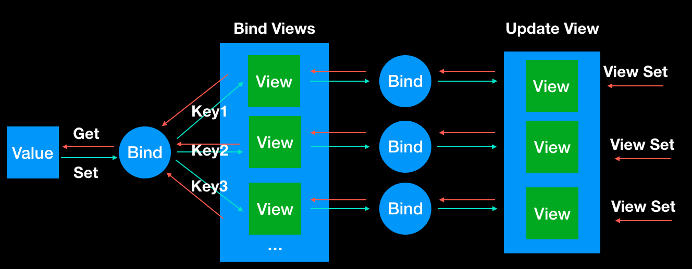
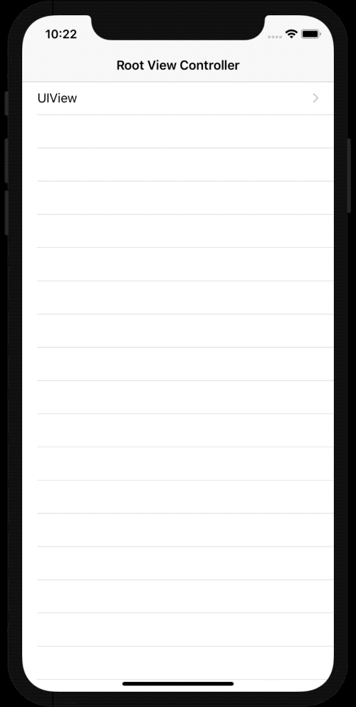
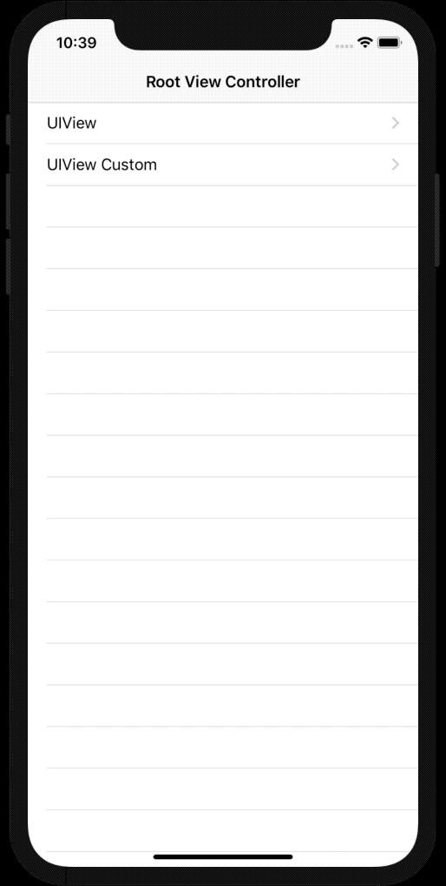
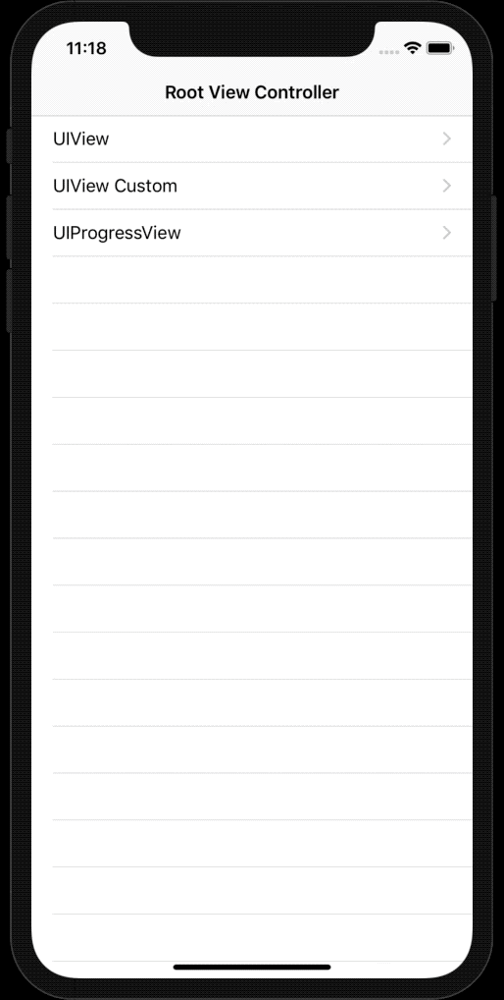
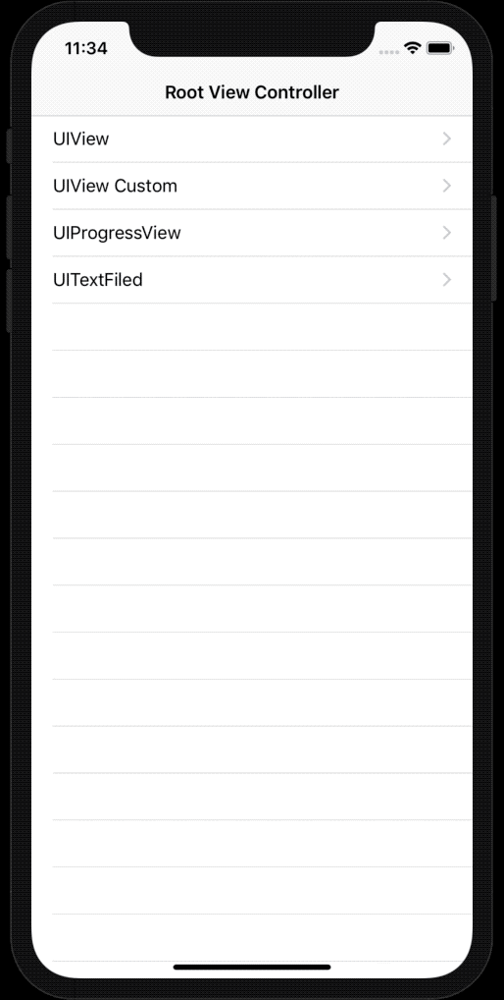
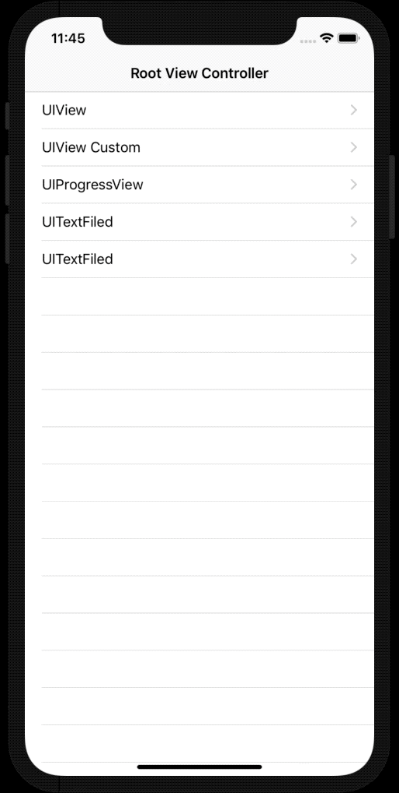
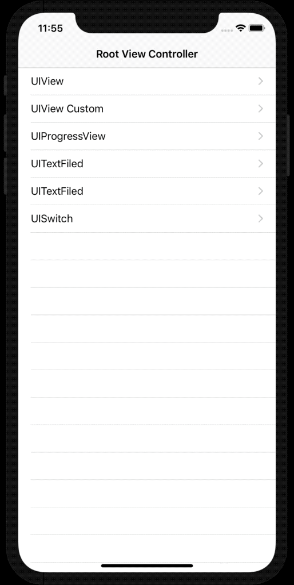
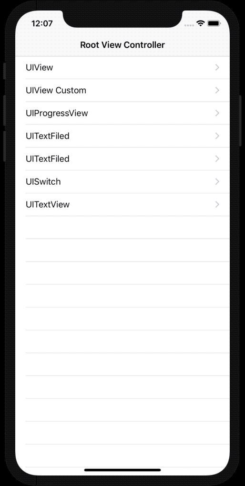

# CombineObject

`CombineObject` 响应式框架 `Swift` 版本, `Value` 和 `View` 相互绑定。



## 安装

### CocoaPods

```ruby
pod 'CombineObject'
```

### Carthage

```ruby
github "combineobject/CombineObject-Swift"
```

### Package

```ruby
https://github.com/combineobject/CombineObject-Swift
```

## 怎么使用

### Example1

> 假如我们界面一个`UIView`和`UILabel`，我们想让`UIView`的背景颜色和`UILabel`的文本颜色一直保持统一。做法很多种，我们看看这个库可以做什么。

- 声明一个变量做控制

  ```swift
  @CombineObjectBind var color = UIColor.gray
  ```
  
- 绑定到试图

  ```swift
  self.displayLabel.bind(identifier: UILabelIdentifier.textColor, combineObject: self._color)
  self.displayView.bind(combineObject: self._color)
  ```
  
- 更新属性更新试图

  ```swift
  self.color = UIColor.red
  ```
  
- 直接更新一个试图的值

``` swift
self.displayView.updateBindValue(value: UIColor.blue)
```



### Example2

> 比如我们的属性没有我们试图绑定属性 我们想接受到属性变化时候更改值

```swift
self._color.bind.combineValueChangedBlock {[weak self] (value) in
    if let boardColor = value as? UIColor {
        self?.displayLabel.layer.borderWidth = 1
        self?.displayLabel.layer.borderColor = boardColor.cgColor
    }
}
```



### Example3

> 属性控制`UIProgressView`属性



### Example4

> 监听输入框的内容



### Example5

> 监听`UISlider`值



### Example6

> 监听`UISwitch`的状态



### Example6

> 监听`UItextView`值变化



## 接口文档

### 目前支持的属性

#### UIView

- backgroundColor
- userInteractionEnabled
- frame
- alpha
- hidden

#### UILabel

- text
- font
- textColor
- attributedText

#### UISwitch

- on

#### UITextField

- text
- placeholder

#### UISlider

- value

#### UIProgressView

- progress

#### UITextView

- text

### 扩展`UIView`的赋值支持属性方法

```swift
public func setUIViewCombineValue(_ identifier: CombineIdentifier, _ value: CombineValue?)
```

### 让其他的对象支持属性绑定

> 实现`CombineView`协议

```swift
func setCombineValue(_ identifier:CombineIdentifier, _ value:CombineValue?)
```

### 自定义赋值

> 实现属性`bine`值的代理方法``

```swift
self.color.bine.setCombineValueBlock = { content in
}
```
